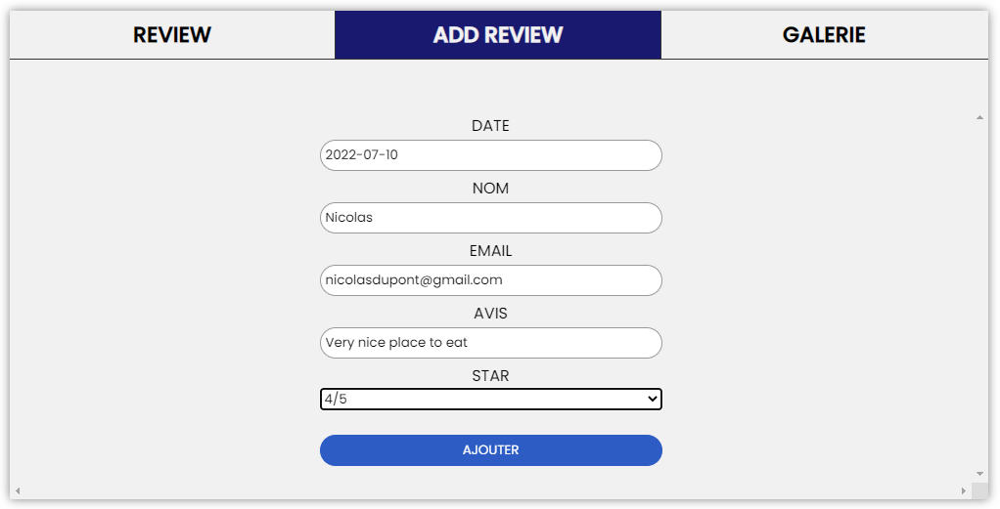
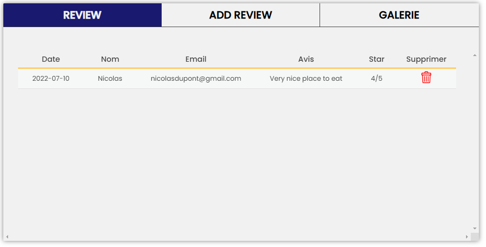
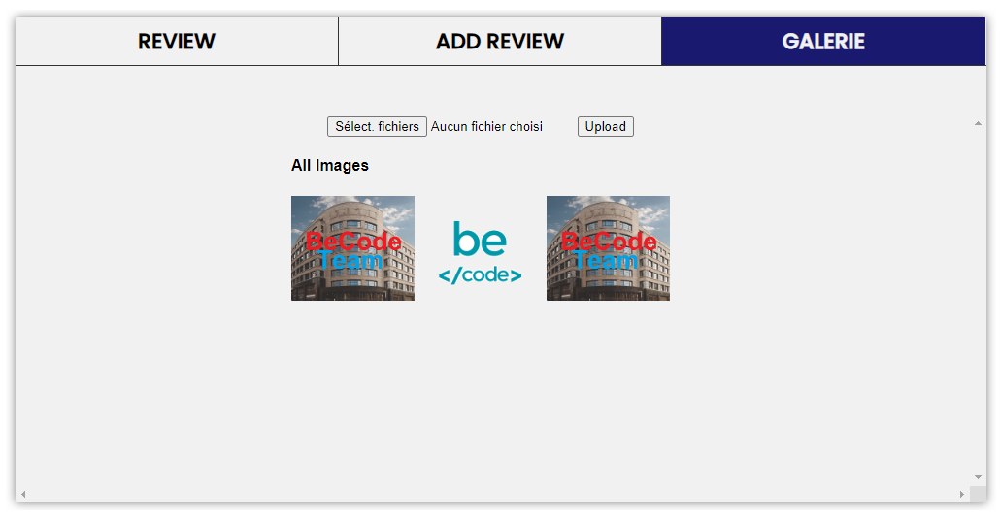

# CRUD Projet

# Online site

Accéder au résultat en cliquant ici : [Online website](https://elazzouzinordinebecode.github.io/crud/) (PHP not supported by GitHub)

## Projet

In this project, the objective is twofold:

1. Implement an option that allows to add a notice in a table from a form that is connected to a My SQL database.
2. Implement an option to upload images to a photo gallery.

### Screenshot of the project

  

### Details des onglets

- Review: the tab that displays the result of the reviews in a table.
- Add review: form to add a review.
- Gallery: tab that allows you to upload images.

### Contributor

If you want to add new cool features. Feel free to submit your suggestions:

1. Download [Git Bash](https://git-scm.com/downloads).
2. Open the receiving location of the folder with Git Bash.
3. Clone the repository with the following instruction :

- **With SSH** : `git clone git@github.com:ElazzouziNordineBeCode/crud.git`
- **With HTTPS** : `git clone https://github.com/ElazzouziNordineBeCode/crud.git`

4. Create your own branch with: `git branch your_name`.
5. Edit the code with : `code . `
   Two editor examples: [Visual Studio Code](https://code.visualstudio.com/download) - [Brackets](https://brackets.io/)

Add your improvements and send them to us in the following order:

- `git add .`
- `git commit -m 'new improvement proposal'`
- `git push origin your_name`

If your improvement is validated, we will publish it, thanks for your help ;)
You are simply :

